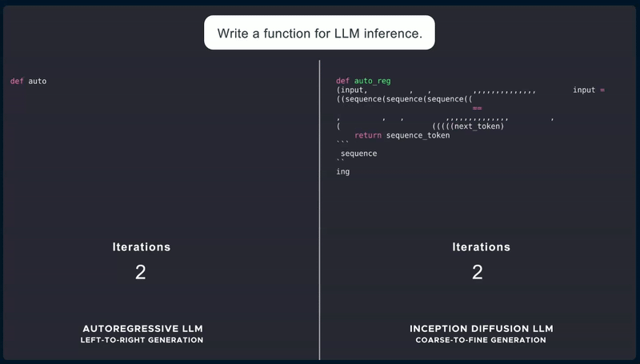
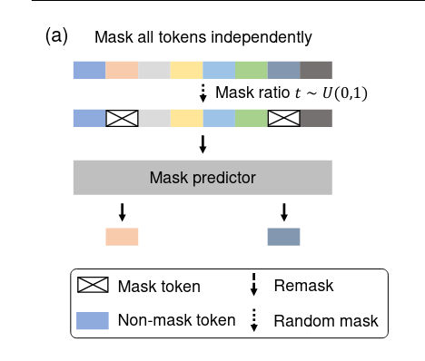

# nanodLLM

<div align="center">
    <figure>
        
        <figcaption><strong>Inceptionlabs' "Mercury" Diffusion LLM</strong></figcaption>
    </figure>
</div>

<br />

This is an educational repository for Diffusion Large Language Models (dLLM) following the same format as [nanoGPT](https://github.com/karpathy/nanoGPT) (Reader should probably be familiar with nanoGPT before going further). It keeps up with the latest advancements in dLLMs, including the recent release of [**LLaDA**](https://arxiv.org/pdf/2502.09992) whose 8B model version is available on [Hugging Face](https://huggingface.co/GSAI-ML/LLaDA-8B-Instruct). dLLMs are diffusion models that utilize a discrete random masking process and train a mask predictor to approximate the reverse process. dLLMs are still an on-going research topic but the first commercial dLLM has already been [released](https://www.inceptionlabs.ai/news) (cf gif above). 

Some advantages of dLLMs over autoregressive (AR) LLMs are : 
- **Faster generation** : dLLMs generate the entire sequence at once and refine it iteratively, allowing for more parallel computation.

- **More diverse outputs** : Diffusion models sample from a richer probability distribution at each step (compared to AR models that optimize for most likely token at each stop), leading to more diverse and creative outputs.

- **More Flexible with Missing or Corrupted Data** : Since diffusion models use a masking and denoising process, they can handle missing data naturally.

# Going from auto-regression to diffusion.

Any auto-regressive GPT-like model can be easily modified to a dLLM. The only thing to do is remove all the causal mask from the self-attention mechanism. We choose to go with the boilerplate GT2 model that can be found in `model.py`.

Likewise, the training of this newly GPT-like dLLM also is altered. The dLLM is now a mask predictor instead of being a next-token predictor. 

For a training sequence $x_0$ (i.e. sentence), we randomly sample $t \in [0, 1]$ and mask each token independently with the same probability $t$ to obtain $x_t$. Estimate the loss function $L(\theta)$ below via Monte Carlo method (i.e. by sampling many $t$) and do gradient descent. The loss function is defined as :

$L(\theta) = - \mathop{\mathbb{E}}_{t,x_0, x_t}\left[\frac{1}{t} \sum_{i=1}^L \mathbb{1}[x_t^i = M] \log p_\theta(x_0^i | x_t) \right]$

where $x_0$ is sampled from the training data, $t$ is sample uniformly from $[0,1]$, and $x_t$ is sampled from the forward process. The indicator function $\mathbb{1}$ ensures that the loss is computed only for the masked tokens.


<div align="center">
    <figure>
    
        <figcaption><strong>Pre-training : dLLM is trained on text with random masks applied independently to all tokens at the same ratio t ∼ U[0, 1]</strong></figcaption>
    </figure>
</div>

Pre-training dLLM code resembles autoregressive model training but with some small changes. 

```python
def forward_process(input_ids, eps=1e-3):
    b, l = input_ids.shape
    t = torch.rand(b, device=input_ids.device)
    p_mask = (1 - eps) * t + eps
    p_mask = p_mask[:, None].repeat(1, l)

    masked_indices = torch.rand((b, l), device=input_ids.device) < p_mask
    # 126336 is used for [MASK] token
    noisy_batch = torch.where(masked_indices, 126336, input_ids)
    return noisy_batch, masked_indices, p_mask

# The data is an integer tensor of shape (b, 4096), 
# where b represents the batch size and 4096 is the sequence length.
input_ids = batch["input_ids"]

# We set 1% of the pre-training data to a random length that is uniformly sampled from the range [1, 4096].
# The following implementation is not elegant and involves some data waste. 
# However, the data waste is minimal, so we ignore it.
if torch.rand(1) < 0.01:
    random_length = torch.randint(1, input_ids.shape[1] + 1, (1,))
    input_ids = input_ids[:, :random_length]

noisy_batch, masked_indices, p_mask = forward_process(input_ids)
logits = model(input_ids=noisy_batch).logits

token_loss = F.cross_entropy(logits[masked_indices], input_ids[masked_indices], reduction='none') / p_mask[masked_indices]
loss = token_loss.sum() / (input_ids.shape[0] * input_ids.shape[1])
```

# Quickstart

Please install relevant dependencies :
```bash 
pip install .
```
Please process the data by running ([nanoGPT](https://github.com/karpathy/nanoGPT)'s code generation was shamelessly taken) : 
```bash
python data/shakespeare_char/prepare.py
```

Please note that, as mentioned earlier, the diffusion model samples from a broader probability distribution, making the training process more challenging for the LLM (compared to next token prediction). This "increased complexity" is reflected in the noisiness of the training and validation loss.

To pre-train your model that will saved in `--save_filename`, run:
```bash 
python train.py --save_filename="PATH.pt"
```
Among the most important hyperparameters that can influence the generation process are : the number of steps you take in your diffusion process and the well-known temperature parameters. You can generate a few samples from the pre-trained model provided and changes hyperparameters values in the file :
```bash
python main.py --path="pretrained_gpt.pt"
```
or given your trained version :
```bash
python main.py --path="PATH.pt"
```


# Source 

Code source used as inspiration : 
 - https://github.com/ML-GSAI/LLaDA/tree/main
 - https://github.com/ML-GSAI/SMDM

Bibliography : 
 - https://arxiv.org/pdf/2502.09992
 - https://arxiv.org/pdf/2410.18514


